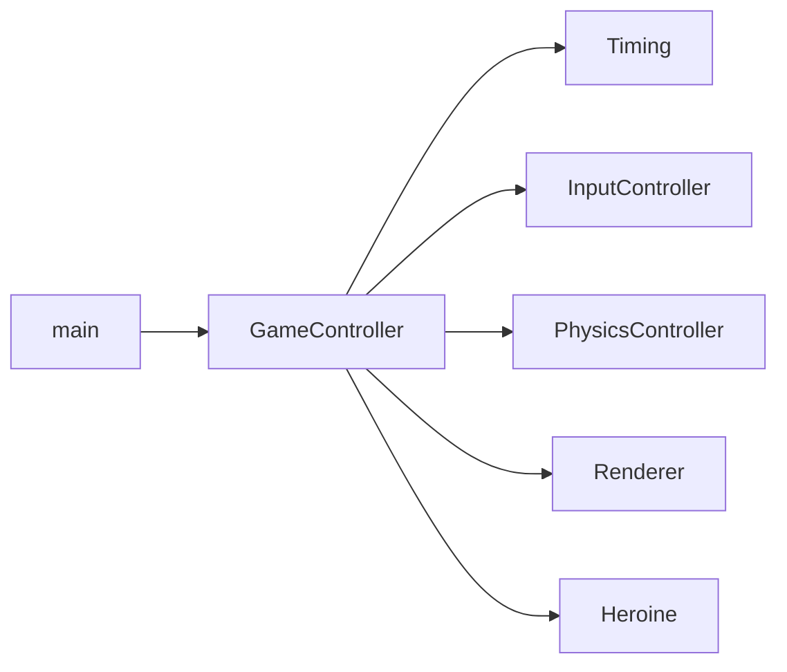

# GameEngine

Educational **C++** game engine built on **SDL2** for 2D rendering, windowing, fonts (**SDL2_ttf**), and audio (**SDL2_mixer**), with **GLM** for vector and matrix math. The repository tracks a **course-style, incremental lab progression**: the overall architecture and subsystem boundaries are provided as **professor-led scaffolding**, with remote branches preserving milestones (graphics, input, audio, math, physics, finite state machines, and related modules).

This document describes how the code on the default line of development is structured, how the main loop runs, and which patterns the project uses throughout.

---

## Repository layout

| Path | Purpose |
|------|--------|
| [`GameEngine.sln`](GameEngine.sln) | Visual Studio solution |
| [`GameEngine/`](GameEngine/) | Application project: engine subsystems, serialization types, and sample gameplay (`Heroine` + state machine) |
| [`GameEngine/main.cpp`](GameEngine/main.cpp) | Entry point: starts the game through `GameController` |
| [`External/`](External/) | Vendored third-party code: **SDL2** (2.26.1), **SDL2_ttf**, **SDL2_mixer**, **glm**. SDL3 is also present under `External/` but is **not** referenced by the Visual Studio project file for this app. |
| [`Assets/`](Assets/) | Runtime art and data loaded via **paths relative to the process working directory** (see [Running and assets](#running-and-assets)) |

---

## Tech stack

- **Language:** C++ (MSVC, Visual Studio 2022 toolset **v143**, Windows SDK **10.0**)
- **Build:** MSBuild via [`GameEngine/GameEngine.vcxproj`](GameEngine/GameEngine.vcxproj)
- **Libraries:** SDL2, SDL2_ttf, SDL2_mixer, GLM (headers under `External/`, libraries for **x64** linked from the same tree)
- **Platform:** Windows is the primary target; **x64** is the configuration with include paths, library paths, and a **Pre-Build** step that copies `SDL2.dll`, `SDL2_ttf.dll`, and `SDL2_mixer.dll` next to the built executable.

---

## Architecture overview

The program is organized around a small set of **long-lived subsystems** (implemented largely as **singletons**), orchestrated by **`GameController`**. The sample loop updates timing, input, physics, and a demo character (`Heroine`), then presents the frame.



### Main game loop

[`GameController::RunGame`](GameEngine/GameController.cpp) implements the classic loop:

1. **`Timing::Tick()`** — updates frame delta from `SDL_GetTicks()` (variable timestep). [`Timing::CapFPS()`](GameEngine/Timing.cpp) exists but is **not** called from the loop in the current sources (it remains available if you want a simple frame cap).
2. **Clear** the render target and **poll SDL events**, dispatching through `HandleInput`.
3. **`PhysicsController::Update`** — advances rigid bodies and particles.
4. **`Heroine::Update` / `Heroine::Render`** — gameplay and drawing for the sample character.
5. **`SDL_RenderPresent`** — show the frame.

Entry is a single call from [`main`](GameEngine/main.cpp):

```3:7:GameEngine/main.cpp
int main()
{
	GameController::Instance().RunGame();

	return 0;
}
```

### Core subsystems

| Area | Primary types | Role |
|------|----------------|------|
| Central orchestration | [`GameController`](GameEngine/GameController.h) | Owns the loop and wires subsystems together |
| Window / 2D draw | [`Renderer`](GameEngine/Renderer.h) | SDL window and renderer, textures, primitives, viewport helpers |
| Input | [`InputController`](GameEngine/InputController.h), `Keyboard`, `Mouse`, `Controller` | Aggregates input devices behind one facade |
| Time | [`Timing`](GameEngine/Timing.h) | Delta time and FPS counting |
| Physics | [`PhysicsController`](GameEngine/PhysicsController.h), `RigidBody`, `Particle` | Gravity, integration, and collision handling |
| Audio | [`AudioController`](GameEngine/AudioController.h), `Song`, `SoundEffect` | SDL_mixer-backed playback |
| Assets | [`AssetController`](GameEngine/AssetController.h), [`Asset`](GameEngine/Asset.h) | GUID-keyed assets; raw file bytes loaded into a **stack allocator** arena |
| Sample gameplay | [`Heroine`](GameEngine/Heroine.h), [`HeroineState`](GameEngine/HeroineState.h) | Demo entity driven by a **finite state machine** |
| Serializable content | [`Resource`](GameEngine/Resource.h), [`Level`](GameEngine/Level.h), [`Unit`](GameEngine/Unit.h) | Binary serialization hierarchy for level-style data |

**Note on `Level` / `Unit`:** These types implement the **serialization and content pipeline** (levels composed of units, with pooling for `Unit`). They are **not** referenced from [`GameController`](GameEngine/GameController.cpp) or [`Heroine`](GameEngine/Heroine.cpp) in the current loop, so the running demo is centered on **`Heroine`** and shared subsystems, not on loading a `Level` instance in `RunGame`.

---

## Methodologies and design patterns

1. **Singleton services** — [`Singleton.h`](GameEngine/Singleton.h) uses a Meyers singleton (`static` local inside `Instance()`). Subsystems such as `Renderer`, `AssetController`, `InputController`, `Timing`, `PhysicsController`, and `AudioController` expose global access this way, matching a **service locator** style common in small engines and course codebases.

2. **Finite state machine (FSM)** — [`HeroineState`](GameEngine/HeroineState.h) defines an abstract state with `HandleInput` and `Update`. Concrete states (`Standing`, `Ducking`, `Jumping`, `Diving`) are **singleton-like static instances** accessed via `GetStandingState()`, and so on. [`Heroine`](GameEngine/Heroine.h) holds a `HeroineState*` and delegates behavior to the active state.

3. **Object pooling** — [`ObjectPool.h`](GameEngine/ObjectPool.h) provides `GetResource` / `ReleaseResource` with a `Reset()` expectation on pooled types. [`GameController::Initialize`](GameEngine/GameController.cpp) sets up pools for `SpriteSheet` and `SpriteAnim`; `Asset` and `Unit` also participate where used.

4. **Stack allocator (arena) for asset bytes** — [`StackAllocator`](GameEngine/StackAllocator.h) backs bulk allocations used when loading file data into [`Asset`](GameEngine/Asset.h) instances. [`AssetController::Initialize`](GameEngine/AssetController.cpp) is given a stack size (for example **10 MB** from `GameController::Initialize`), and [`FileController`](GameEngine/FileController.cpp) reads files into memory obtained from that stack.

5. **Binary serialization** — [`Serializable`](GameEngine/Serializable.h) is the base interface for streaming. [`Resource`](GameEngine/Resource.h) adds helpers such as `SerializePointer` / `DeserializePointer` and `SerializeAsset` / `DeserializeAsset` so graphs of resources and nested assets can be written and read as binary streams.

6. **Shared headers and configuration** — [`StandardIncludes.h`](GameEngine/StandardIncludes.h) centralizes SDL (`SDL_MAIN_HANDLED`), optional native resolution defines, GLM experimental includes, and platform-specific macros such as `M_ASSERT` and `GetCurrentDir`. The file also pulls in `using namespace std`, which is a **course style** choice rather than a general production convention.

---

## Building

1. Install **Visual Studio 2022** with the **Desktop development with C++** workload.
2. Open [`GameEngine.sln`](GameEngine.sln).
3. Select configuration **Debug** or **Release** and platform **x64** (recommended; this is where SDL include/lib paths and DLL copy steps are configured in [`GameEngine.vcxproj`](GameEngine/GameEngine.vcxproj)).
4. Build the **GameEngine** project.

The **Pre-Build** event copies SDL DLLs into the output directory so the executable can start without manual copying.

---

## Running and assets

File loading uses **paths as passed to the C runtime** (see [`FileController::ReadFile`](GameEngine/FileController.cpp)), so behavior depends on the **current working directory** of the process.

Example paths used in the project:

- [`Heroine`](GameEngine/Heroine.cpp) loads a texture via a path such as `../Assets/Textures/Warrior.tga`.
- [`TTFont`](GameEngine/TTFont.cpp) loads `../Assets/Fonts/arial.ttf`.

With the repository’s usual layout (`GameEngine` solution folder containing the inner `GameEngine` project), resolving `../Assets/...` expects the **working directory to be the inner project directory** (the folder that contains `GameEngine.vcxproj`), so that `..` refers to the solution root where the [`Assets/`](Assets/) folder lives.

**Practical tips:**

- In Visual Studio, set **Project Properties → Debugging → Working Directory** to `$(ProjectDir)` if F5 does not find assets.
- Ensure the files referenced in code exist under `Assets/` (or adjust paths). If a referenced file is missing locally, loading will fail at the `M_ASSERT` sites in font/texture initialization.

---

## Branches

Remote branches follow a **lab and milestone naming scheme** (for example `lab2-*` through `lab8-*`, plus names such as `lab5-1_InputCore`, `lab6-1_AudioCore`, `lab7-10_Matrices`, `lab8-1_Physics`, `GraphicsCore_2`, `GraphicsCore_3`, `FiniteStateMachine`, `master3.0`, and similar). In this repository they are treated as **incremental course checkpoints** building on the same overall **professor-provided engine architecture**, not as separate products. Individual branches are not documented here in depth; check out a branch to see that week’s focus (input, graphics, audio, linear algebra, physics, state machines, and so on).

---

## Where to read the code first

- [`GameEngine/main.cpp`](GameEngine/main.cpp) — entry
- [`GameEngine/GameController.cpp`](GameEngine/GameController.cpp) — initialization, shutdown, and main loop
- [`GameEngine/Renderer.h`](GameEngine/Renderer.h) / [`Renderer.cpp`](GameEngine/Renderer.cpp) — SDL drawing surface
- [`GameEngine/Heroine.cpp`](GameEngine/Heroine.cpp) / [`HeroineState.cpp`](GameEngine/HeroineState.cpp) — FSM-driven sample entity
- [`GameEngine/AssetController.cpp`](GameEngine/AssetController.cpp) / [`FileController.cpp`](GameEngine/FileController.cpp) — asset loading
- [`GameEngine/ObjectPool.h`](GameEngine/ObjectPool.h) — pooling template
- [`GameEngine/Resource.h`](GameEngine/Resource.h) — serialization base for game data

---

## Credits and third-party licenses

- **Engine structure and lab progression:** course / professor-led educational baseline; this README describes that design for contributors and visitors.
- **Third-party:** SDL2, SDL2_ttf, SDL2_mixer, and GLM ship under their own terms inside [`External/`](External/). See each library’s `README`, `COPYING`, or `LICENSE` file in its subdirectory for full text.
